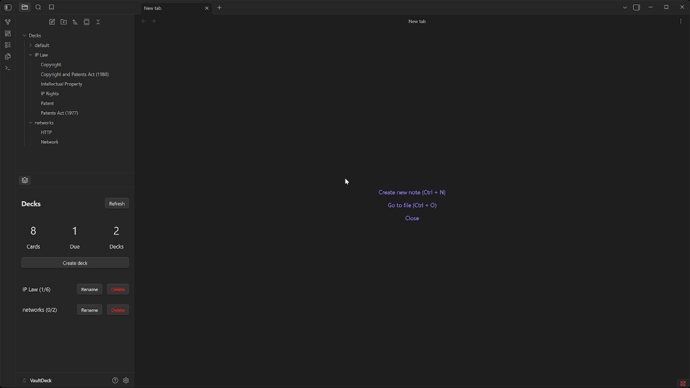

# Vault Deck


> A native Obsidian plugin for creating and reviewing flashcards using plain Markdown files.

This plugin provides lightweight spaced repetition, deck-based organization, and fast review workflows without relying on external databases or proprietary formats.



## Design Philosophy
- Obsidian-native
- Markdown-only storage
- Minimal but effective spaced repetition
- No external dependencies
- Easy to extend and customize

## Features
- Markdown-first flashcards (one file per card)
- Folder and metadata-based decks
- Minimal spaced repetition system
- Command-based creation and review
- Modal-based review experience
- Right-side panel with deck and review overview
- Fully transparent data stored in frontmatter

## Commands
### Create Commands
- `Create flashcard` - Creates a new blank flashcard Markdown file using the default deck and template.
- `Create flashcard selection` - Creates a new flashcard with the current editor selection inserted into the Back section and the cursor placed in the Front section.

### Review Commands
- `Review flashcards` - Review all flashcards across all decks.
- `Review flashcards due` - Review all flashcards that are currently due across all decks.

## Flashcard Format
Each flashcard is a standalone Markdown file with frontmatter metadata and clearly separated front and back sections.

```md
---
type: flashcard
deck: networks
lastReviewed: 2026-02-10T16:31:35.506Z
due: 2026-02-11T16:31:35.506Z
interval: 1
---

## Front
What is a network?

## Back
A group of two ore more devices connected together through wires or witelessly to communicate and/or share resources.

```

### Frontmatter Properties
| Property       | Type       | Description             |
| -------------- | ---------- | ----------------------- |
| `type`         | string     | Must be `flashcard`     |
| `deck`         | string     | Deck name               |
| `lastReviewed` | datetime   | Last review date        |
| `due`          | datetime   | Next scheduled review   |
| `interval`     | number     | Review interval in days |

All scheduling logic is stored directly in frontmatter for transparency and manual editing if desired.

## Review System
### Review Flow
1. Flashcards are loaded into a review queue
2. Due cards are prioritized
3. Cards are randomized within their priority group
4. The Front is shown first
5. The card can be flipped to reveal the Back
6. The user selects a difficulty rating
7. The card’s interval and due date are updated

### Difficulty Intervals
Intervals are selected on the Back side only.

| Difficulty | Interval |
| ---------- | -------- |
| Hard       | 1 day    |
| Medium     | 3 days   |
| Easy       | 7 days   |

Selecting a difficulty updates:
- interval
- due
- lastReviewed

## Side Panel
The plugin provides an optional right-side panel with an overview of flashcard activity and list of decks.

### Panel Information
- Total number of flashcards
- Total number of flashcards due
- Total number of decks
- List of decks with total cards and total due

### Panel Actions
- Deck name button - start reviewing all cards in deck
- Rename button - rename deck
- Delete Button - delete deck

## Settings
The plugin includes a settings tab for configuration.

### Available Settings
- Decks root folder - containing all flashcards
- Default deck name - newly created cards are saved

```ts
interface FlashcardSettings {
  decksRootFolder: string;
  defaultDeck: string;
}
```

## Licence
MIT
